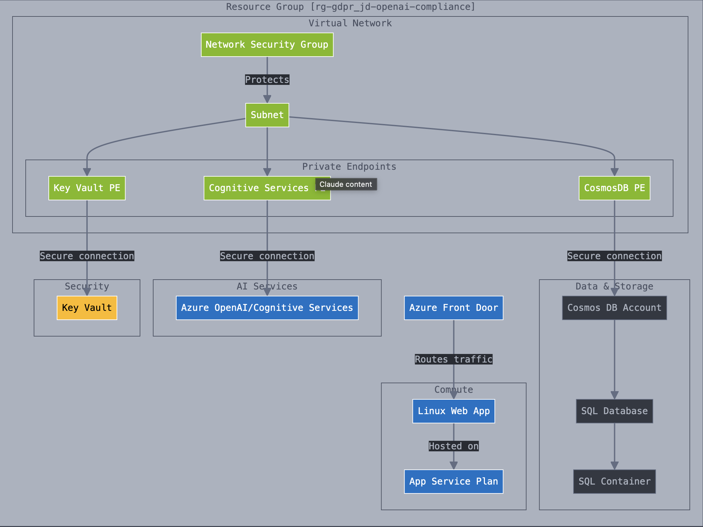

#### Terraform Configuration for GDPR-Compliant Azure OpenAI Solution

This Terraform configuration sets up a GDPR-compliant Azure OpenAI solution with various Azure resources. Below is a summary of the resources created:

1. **Terraform Block**
   - Specifies the required Terraform version and providers.

2. **Azure Provider Configuration**
   - Configures the Azure provider with specific features.

3. **Data Source**
   - Retrieves information about the current Azure client configuration.

4. **Resource Group**
   - Creates a resource group for the GDPR-compliant Azure OpenAI solution.

5. **Virtual Network**
   - Configures a virtual network.

6. **Subnet**
   - Configures a subnet within the virtual network.

7. **Network Security Group**
   - Creates a network security group with specific security rules.

8. **Azure Front Door**
   - Sets up Azure Front Door for secure access.

9. **Cosmos DB Account**
   - Creates a Cosmos DB account with strong encryption and access controls.

10. **Cosmos DB SQL Database**
    - Creates a Cosmos DB SQL database.

11. **Cosmos DB SQL Container**
    - Creates a Cosmos DB container for JSON documents.

12. **Azure OpenAI Service**
    - Sets up an Azure OpenAI service.

13. **Key Vault**
    - Creates a Key Vault for encryption keys and secrets.

14. **Linux Web App**
    - Sets up a Linux web app for the chat interface.

15. **App Service Plan**
    - Creates an app service plan for the Linux web app.

16. **Private Endpoints**
    - Creates private endpoints for Key Vault, Cosmos DB, and Cognitive Services.


## Architecture



### Instructions to Use a Service Principal to Login to Azure and Run Terraform

1. **Create a Service Principal**

   First, create a Service Principal in Azure. You can do this using the Azure CLI:

   ```sh
   az ad sp create-for-rbac --name "myServicePrincipal" --role="Contributor" --scopes="/subscriptions/<subscription-id>"
   ```

   This command will output the following details:
   - `appId`: The application ID of the Service Principal.
   - `displayName`: The display name of the Service Principal.
   - `password`: The password for the Service Principal.
   - `tenant`: The tenant ID.

2. **Set Environment Variables**

   Export the Service Principal credentials as environment variables. This allows Terraform to authenticate with Azure using the Service Principal.

   ```sh
   export ARM_CLIENT_ID="<appId>"
   export ARM_CLIENT_SECRET="<password>"
   export ARM_SUBSCRIPTION_ID="<subscription-id>"
   export ARM_TENANT_ID="<tenant>"
   ```

3. **Initialize Terraform**

   Navigate to the directory containing your Terraform configuration files and initialize Terraform:

   ```sh
   terraform init
   ```

4. **Plan the Terraform Deployment**

   Generate and review the execution plan for your Terraform configuration:

   ```sh
   terraform plan
   ```

5. **Apply the Terraform Configuration**

   Apply the Terraform configuration to create the resources in Azure:

   ```sh
   terraform apply
   ```

   Confirm the apply action when prompted.

By following these steps, you can use a Service Principal to authenticate with Azure and run your Terraform configuration.


# Resources:


### Create Front Door with terraform

<https://learn.microsoft.com/en-us/azure/frontdoor/create-front-door-terraform>

